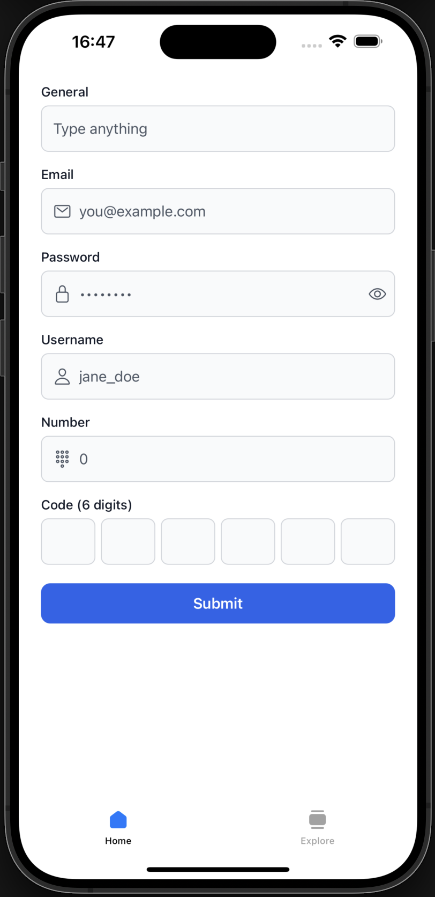

# Evolve UI

React Native component library with a central theme file: `evolve.config`.


## Preview



## Requirements

- Node.js with npm, pnpm, or yarn
- A **React Native** app with **React 18+** and **React Native 0.72+** (peer dependencies)

## Installation

In your app directory, install the library and `@expo/vector-icons` (used for `Input` icons):

```bash
npm install @felipeeweiss/evolve-ui @expo/vector-icons
```

With Yarn or pnpm:

```bash
yarn add @felipeeweiss/evolve-ui @expo/vector-icons
```

```bash
pnpm add @felipeeweiss/evolve-ui @expo/vector-icons
```

`react` and `react-native` are peer dependencies: they are not installed by this package and must already be present in your app.

## Theme setup

1. Add **`evolve.config.ts`** (or `.js`) at your app root. You can start from the bundled `evolve.config.example.ts` in this package and adjust values.

2. Wrap your app with **`EvolveUIProvider`** and pass the config object:

```tsx
import { EvolveUIProvider, Button } from '@felipeeweiss/evolve-ui';
import evolveConfig from './evolve.config';

export default function App() {
  return (
    <EvolveUIProvider config={evolveConfig}>
      <Button variant="primary" onPress={() => {}}>
        Save
      </Button>
    </EvolveUIProvider>
  );
}
```

3. The theme may include `colors.inputBorder` and `colors.error` (defaults are provided) for `Input` borders and error text, and `colors.toastBackground` plus `colors.toastIcon*` for the `Toast` card and icons.

4. Components read colors via `useEvolveUI()`. Where supported, override layout and typography with `style` and `textStyle` (for example on `Button` and `inputStyle` on `Input`).

## `Input` component

- **Layout**: label on top (left-aligned), field below, and optional `error` string under the field. When `error` is set, the border uses the theme’s `error` color.
- **Variants**: `general` (default), `email`, `password`, `username`, `number`, and `code`.
- **General**: a single `TextInput` with no leading icon.
- **Email, password, username, number**: a leading `Ionicons` glyph and a keyboard type suited to the variant (`email-address`, `numeric`, etc.).
- **Password**: `secureTextEntry` with a right-side control to show or hide the value.
- **Code**: a row of one-digit cells (default length `6` via `codeLength`). Digits are controlled through `value` / `onChangeText` as a single string. On backspace in an empty cell, focus moves to the previous field.

```tsx
import { EvolveUIProvider, Input } from '@felipeeweiss/evolve-ui';

<EvolveUIProvider config={evolveConfig}>
  <Input label="Email" variant="email" value={email} onChangeText={setEmail} error={emailError} />
  <Input label="Password" variant="password" value={pw} onChangeText={setPw} />
  <Input label="Code" variant="code" value={code} onChangeText={setCode} codeLength={6} />
</EvolveUIProvider>
```

## `Toast` component

- Renders a full-width **modal** at the **top** of the screen, slides in from above, stays **3 seconds** (override with `duration` in ms), then slides out upward and calls `onDismiss`.
- **Variants** (`success` | `error` | `info` | `warning`): same `colors.toastBackground` for the card; the **left** `Ionicons` glyph and `colors.toastIcon*` change per variant.
- **Content**: `title` (up to 2 lines) and optional `description` (up to 2 lines) to the right of the icon.
- After a timed dismiss, set your `visible` state to `false` inside `onDismiss` so the next open works.

```tsx
const [t, setT] = useState({ visible: false, variant: 'info' as const, title: 'Hi', text: '' });

<Toast
  visible={t.visible}
  variant={t.variant}
  title={t.title}
  description={t.text}
  onDismiss={() => setT((s) => ({ ...s, visible: false }))}
/>
```

## License

MIT
