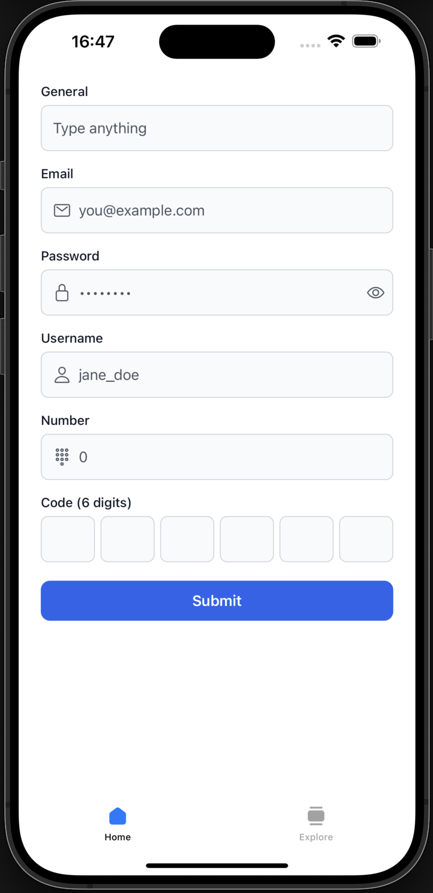

# Evolve UI

React Native component library with a central theme file: `evolve.config`.


## Preview



## Requirements

- Node.js with npm, pnpm, or yarn
- A **React Native** app with **React 18+** and **React Native 0.72+** (peer dependencies)

## Installation

In your app directory, install the library and `@expo/vector-icons` (used for icons on `Input` and `Select`):

```bash
npm install @felipeeweiss/evolve-ui @expo/vector-icons
```

With Yarn or pnpm:

```bash
yarn add @felipeeweiss/evolve-ui @expo/vector-icons
```

```bash
pnpm add @felipeeweiss/evolve-ui @expo/vector-icons
```

`react` and `react-native` are peer dependencies: they are not installed by this package and must already be present in your app.

## Theme setup

1. Add **`evolve.config.ts`** (or `.js`) at your app root. You can start from the bundled `evolve.config.example.ts` in this package and adjust values.

2. Wrap your app with **`EvolveUIProvider`** and pass the config object:

```tsx
import { EvolveUIProvider, Button } from '@felipeeweiss/evolve-ui';
import evolveConfig from './evolve.config';

export default function App() {
  return (
    <EvolveUIProvider config={evolveConfig}>
      <Button variant="primary" onPress={() => {}}>
        Save
      </Button>
    </EvolveUIProvider>
  );
}
```

3. The theme may include `colors.inputBorder` and `colors.error` (defaults are provided) for field borders and error text on `Input`, `Select`, `Checkbox`, and `RadioGroup`; `colors.surface`, `colors.title`, `colors.body`, and `colors.primary` for surfaces and accents; `colors.progressBarTrack` and `colors.progressBarFill` for `ProgressBar`; and `colors.toastBackground` plus `colors.toastIcon*` for the `Toast` card and icons.

4. Components read colors via `useEvolveUI()`. Where supported, override layout and typography with `style` and `textStyle` (for example on `Button` and `inputStyle` on `Input`).

## `Input` component

- **Layout**: label on top (left-aligned), field below, and optional `error` string under the field. When `error` is set, the border uses the theme’s `error` color.
- **Variants**: `general` (default), `email`, `password`, `username`, `number`, `textarea`, and `code`.
- **General**: a single `TextInput` with no leading icon.
- **Email, password, username, number**: a leading `Ionicons` glyph and a keyboard type suited to the variant (`email-address`, `numeric`, etc.).
- **Password**: `secureTextEntry` with a right-side control to show or hide the value.
- **Textarea**: multiline field with top-aligned text and the same border/surface style as the other input variants. Use `numberOfLines` (default `5`) as a minimum height hint.
- **Code**: a row of one-digit cells (default length `6` via `codeLength`). Digits are controlled through `value` / `onChangeText` as a single string. On backspace in an empty cell, focus moves to the previous field.

```tsx
import { EvolveUIProvider, Input } from '@felipeeweiss/evolve-ui';

<EvolveUIProvider config={evolveConfig}>
  <Input label="Email" variant="email" value={email} onChangeText={setEmail} error={emailError} />
  <Input label="Password" variant="password" value={pw} onChangeText={setPw} />
  <Input label="Bio" variant="textarea" value={bio} onChangeText={setBio} numberOfLines={5} />
  <Input label="Code" variant="code" value={code} onChangeText={setCode} codeLength={6} />
</EvolveUIProvider>
```

## `Select` component

- **Controlled**: `value` (`string | null`) and `onValueChange`.
- **Options**: `options` is an array of `{ label, value, disabled? }`.
- **Layout**: label on top, trigger row styled like `Input` (`surface` background, `inputBorder`), placeholder text uses `body`, selected value uses `title`.
- **Picker**: tapping opens a centered modal listing options; the active row shows a check icon in `primary`.

```tsx
import { EvolveUIProvider, Select } from '@felipeeweiss/evolve-ui';

const countryOptions = [
  { label: 'Brazil', value: 'br' },
  { label: 'Portugal', value: 'pt' },
];

<EvolveUIProvider config={evolveConfig}>
  <Select
    label="Country"
    placeholder="Choose a country"
    value={country}
    onValueChange={setCountry}
    options={countryOptions}
    error={countryError}
  />
</EvolveUIProvider>
```

## `Checkbox` component

- **Controlled**: `checked` and `onChange(boolean)`.
- **Layout**: optional `description` under the label; optional `error` below the row (border uses `error` when set).
- **States**: disabled lowers opacity; checked state fills the box with `primary` and a simple check mark in `primaryText`.

```tsx
import { EvolveUIProvider, Checkbox } from '@felipeeweiss/evolve-ui';

<EvolveUIProvider config={evolveConfig}>
  <Checkbox
    label="Accept terms"
    description="You must accept to continue."
    checked={accepted}
    onChange={setAccepted}
    error={acceptedError}
  />
</EvolveUIProvider>
```

## `RadioGroup` component

- **Controlled**: `value` (`string | null`) and `onValueChange`.
- **Options**: `options` is an array of `{ label, value, description?, disabled? }`.
- **Layout**: optional group `label`; options are stacked in one bordered container (`surface`, separators with `inputBorder`); selected row shows the inner dot in `primary`.

```tsx
import { EvolveUIProvider, RadioGroup } from '@felipeeweiss/evolve-ui';

const planOptions = [
  { label: 'Free', value: 'free' },
  { label: 'Pro', value: 'pro', description: 'Best for teams' },
];

<EvolveUIProvider config={evolveConfig}>
  <RadioGroup
    label="Plan"
    value={plan}
    onValueChange={setPlan}
    options={planOptions}
    error={planError}
  />
</EvolveUIProvider>
```

## `ProgressBar` component

- **Progress**: `progress` is a number **from 0 to 1**; values outside that range are **clamped**.
- **Shape**: thin horizontal pill (`borderRadius = height / 2`), flat track and fill (no border or shadow).
- **Colors**: track uses `colors.progressBarTrack`, filled portion uses `colors.progressBarFill`.
- **`height`**: optional thickness in dp (default **8**). **`style`**: pass **`width`** or margins on the outer wrapper as needed.

```tsx
import { EvolveUIProvider, ProgressBar } from '@felipeeweiss/evolve-ui';

<EvolveUIProvider config={evolveConfig}>
  <ProgressBar progress={0.75} />
  <ProgressBar progress={downloadPct / 100} height={6} style={{ marginTop: 12 }} />
</EvolveUIProvider>
```

## `Toast` component

- Renders a full-width **modal** at the **top** of the screen, slides in from above, stays **3 seconds** (override with `duration` in ms), then slides out upward and calls `onDismiss`.
- **Variants** (`success` | `error` | `info` | `warning`): same `colors.toastBackground` for the card; the **left** `Ionicons` glyph and `colors.toastIcon*` change per variant.
- **Content**: `title` (up to 2 lines) and optional `description` (up to 2 lines) to the right of the icon.
- After a timed dismiss, set your `visible` state to `false` inside `onDismiss` so the next open works.

```tsx
const [t, setT] = useState({ visible: false, variant: 'info' as const, title: 'Hi', text: '' });

<Toast
  visible={t.visible}
  variant={t.variant}
  title={t.title}
  description={t.text}
  onDismiss={() => setT((s) => ({ ...s, visible: false }))}
/>
```

## `Switch` component

- **Controlled**: `checked` and `onChange(boolean)`.
- **Layout**: optional `label` and `description` on the left; an animated toggle track on the right.
- **Animation**: the thumb slides smoothly between the off and on positions (180 ms). Track color transitions between `inputBorder` (off) and `primary` (on); the thumb is always `primaryText`.
- **States**: disabled lowers opacity.

```tsx
import { EvolveUIProvider, Switch } from '@felipeeweiss/evolve-ui';

<EvolveUIProvider config={evolveConfig}>
  <Switch
    label="Notifications"
    description="Receive push alerts."
    checked={notifs}
    onChange={setNotifs}
  />
  <Switch
    label="Dark mode"
    checked={dark}
    onChange={setDark}
    disabled
  />
</EvolveUIProvider>
```

## `Badge` component

- **Label**: short text rendered inside a full-radius pill.
- **Variants** (`primary` | `secondary` | `success` | `error` | `warning` | `info`): `primary` and `secondary` use the matching theme palette; semantic variants (`success`, `error`, `warning`, `info`) reuse the `toastIcon*` colors as background with white text.
- **Sizes** (`sm` | `md`): controls font size and padding. Default is `md`.
- Aligns to `flex-start` by default; wrap in a `View` to control positioning.

```tsx
import { EvolveUIProvider, Badge } from '@felipeeweiss/evolve-ui';

<EvolveUIProvider config={evolveConfig}>
  <Badge label="New" variant="primary" />
  <Badge label="Saved" variant="success" size="sm" />
  <Badge label="Failed" variant="error" />
  <Badge label="Beta" variant="secondary" />
</EvolveUIProvider>
```

## `Avatar` component

- **Image**: pass `source` as a URI object (`{ uri: '...' }`) or a `require()` asset. Falls back to initials on error or when omitted.
- **Initials**: up to 2 characters from `initials`; background uses `primary`, text uses `primaryText`.
- **Sizes** (`sm` | `md` | `lg`): 32 dp / 48 dp / 64 dp circles. Default is `md`.
- Override the container with `style` (e.g. to add a border ring).

```tsx
import { EvolveUIProvider, Avatar } from '@felipeeweiss/evolve-ui';

<EvolveUIProvider config={evolveConfig}>
  <Avatar source={{ uri: 'https://example.com/photo.jpg' }} size="lg" />
  <Avatar initials="FW" size="md" />
  <Avatar
    source={{ uri: user.photo }}
    initials={user.name.slice(0, 2)}
    size="sm"
    style={{ borderWidth: 2, borderColor: '#0D9488' }}
  />
</EvolveUIProvider>
```

## License

MIT
